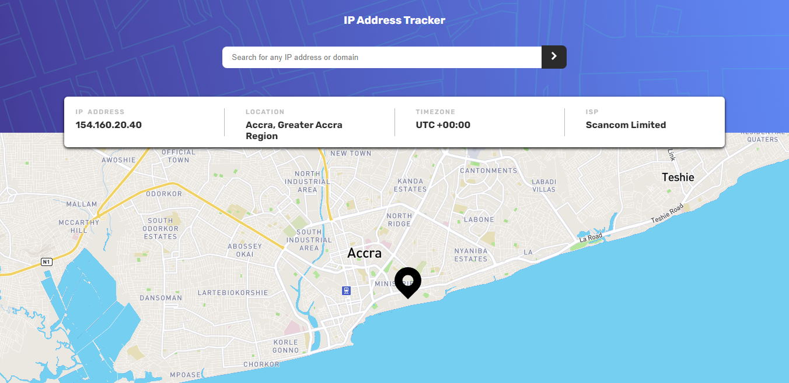

# Frontend Mentor - IP address tracker solution

This is a solution to the [IP address tracker challenge on Frontend Mentor](https://www.frontendmentor.io/challenges/ip-address-tracker-I8-0yYAH0). Frontend Mentor challenges help you improve your coding skills by building realistic projects. 

## Table of contents

- [Overview](#overview)
  - [The challenge](#the-challenge)
  - [Screenshot](#screenshot)
  - [Links](#links)
- [My process](#my-process)
  - [Built with](#built-with)
  - [What I learned](#what-i-learned)
- [Author](#author)

**Note: Delete this note and update the table of contents based on what sections you keep.**

## Overview

### The challenge

Users should be able to:

- View the optimal layout for each page depending on their device's screen size
- See hover states for all interactive elements on the page
- See their own IP address on the map on the initial page load
- Search for any IP addresses or domains and see the key information and location

### Screenshot

### Links

- Solution URL: [Frontend Mentor Solution](https://www.frontendmentor.io/solutions/responsive-ip-address-tracker-with-leaflet-and-ipify-OSSYPDqWC)
- Live Site URL: [IP Address Tracker](https://alosoft.github.io/frontend_mentor-ip-address-tracker-master/)

## My process

### Built with

- Semantic HTML5 markup
- CSS custom properties
- BEM
- Flexbox
- Desktop-first workflow
- [React](https://reactjs.org/) - JS library

### What I learned

The design (UI) wasn't that tough to put in code but I enjoyed the API integration aspect of this challenge.
I used IPify Geolocation API (https://geo.ipify.org) to get the IP Address location data as well as Leaflet (https://leafletjs.com) to generate the map.

## Author

- Website - [Raymond Adutwum Agyei](https://corps-ai.herokuapp.com)
- Frontend Mentor - [@alosoft](https://www.frontendmentor.io/profile/alosoft)
- Linkedin - [Raymond Adutwum Agyei](https://www.linkedin.com/in/raymond-adutwum-agyei-366929117/)
